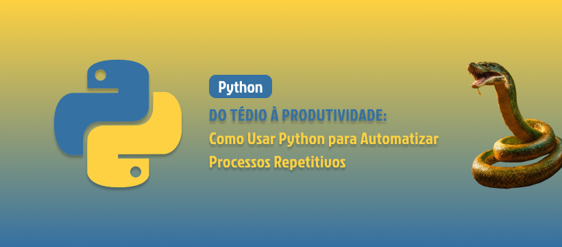

    

  
  

-------

  

# Projeto artigo técnico gerado por I.A.s

Projeto com o objetivo de gerar um artigo técnico com um layout rico, leitura agradável e com foco em promover sua autoridade técnica, além de aprender a gerar prompts mais assertivos.

<a href="https://web.dio.me/articles/do-tedio-a-produtividade-como-usar-python-para-automatizar-processos-repetitivos?back=%2Farticles&open-modal=true&page=1&order=oldest" title="View PDF now"> 📕Clique aqui para ler o artigo</a>

## 💻 Tecnologias utilizadas no projeto

- [ChatGPT](https://chat.openai.com/) - para título e conteúdo
- [Lexica.art](https://lexica.art/) - para gerar imagens
- [Figma](https:/figma.com) - Para edição de banners e imagens

## 📄 Prompts e ferramentas

ChatGPT：

|   Ação   | prompt                                                                                                                                                                                                                                                                         |
| :------: | ------------------------------------------------------------------------------------------------------------------------------------------------------------------------------------------------------------------------------------------------------------------------------ |
|  título  | Crie 10 headlines sobre o tema automação de tarefas com python                                                                                                                                                                                                  |
| conteúdo | Comporte-se como um escritor de artigos tech especialista em automatizar processos com Python e escreva o artigo atendendo as regras abaixo:

{REGRAS}
> No máximos 5 linhas por blocos de explicação
> Me explique de uma maneira informal, como se fosse uma criança de 10 anos
> Os blocos que serão criados estão abaixo:
- Os motivos para escolher python para automação de processos
- Exemplos práticos com código de automação de processos e bibliotecas utilizadas
- Faça um call to action para minhas redes sociais
- Coloque 3 hashtags que façam sentido |

| complemento | dê um exemplo usando a biblioteca pyautogui |

Lexica.art：

- No léxica utilizamos o acervo público de imagens geradas por outras pessoas, os termos de pesquisa que utilizei durante a gravação do conteúdo foram:

• cyberpunk yellow/blue
• python

## ✨ Features

- Conteúdo gerado via ChatGPT
- Imagens do acervo público geradas via Lexica.art

## 📚 Materiais

- prompts utilizados

## 🛠️ Instruções de execução

Utilize os prompts acima nas ferramentas sugeridas para gerar o material base e utilize uma ferramenta de edição de documentos como power point, canva, figma, indesign para diagramação.

## 👨‍💻 Expert

    
    
&nbsp&nbsp&nbspFelipe Aguiar 
    &nbsp&nbsp&nbsp
    <a href="https://github.com/felipeAguiarCode">
    GitHub</a>&nbsp;|&nbsp;
    <a href="www.linkedin.com/in/
felipe-exe">LinkedIn</a>
&nbsp;|&nbsp;
    <a href="https://www.instagram.com/felipeaguiar.exe/">
    Instagram</a>
&nbsp;|&nbsp;

  

---

⌨️ com 💜 por [Felipe Aguiar](https://github.com/felipeAguiarCode)
